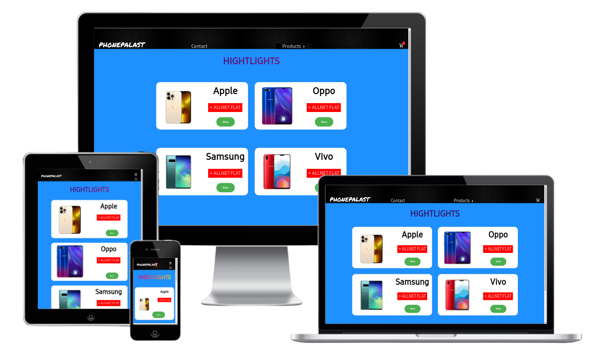

# Project – Shop

This project was created as part of the further education at DCI. 
It is a shop implemented as a single-page application (SPA) using React and various hooks such as useState, useEffect, useNavigate, and useContext.

## Features

- Product overview
- Product detail view
- Shopping cart
- Order process
- Login (username: "adem" password: "tozlu")
- Contact

## Table of contents

- [Overview](#overview)
  - [Screenshot](#screenshot)
  - [Links](#links)
- [My process](#my-process)
  - [Built with](#built-with)
  - [Frameworks](#frameworks)
  - [Tools](#tools)
  - [What I learned](#what-i-learned)
- [Author](#author)

## Overview

### Screenshot

### Links

- Solution URL: [Github Solutions](https://github.com/Adem-Tozlu/Project-Shop)
- Live Site URL: [Website Shop](https://project-shop-xi.vercel.app/)

## My process

### Built with

- Semantic HTML5 markup
- SASS/SCSS
- Mobile-design
- Grid
- Javascript

## Frameworks
 - React

## Hooks
 - useState
 - useEffect
 - useContext
 - useNavigate

## Tools
 - Vite

### What I learned

By developing this shop, I have not only significantly expanded my React knowledge and skills, but also gained valuable practical experience in implementing complex web applications.
These experiences will be beneficial to me in my further career as a developer.
## Author

- Website - [Github](https://github.com/Adem-Tozlu)
- Frontend Mentor – [@Adem-Tozlu](https://www.frontendmentor.io/profile/Adem-Tozlu)
- Linkedin - [@Adem-Tozlu](https://www.linkedin.com/in/adem-tozlu-8906b52a5)